# PDF to Images Converter Plugin

A powerful Dify plugin that converts PDF files to high-quality images using PyMuPDF. Perfect for document processing workflows and LLM vision applications.

**Author:** aToy0m0  
**Version:** 1.0.0  
**Type:** tool

## 📄 What is PDF to Images Conversion?

PDF to Images conversion is a crucial process in document processing workflows, especially for AI applications that need to analyze visual content, forms, diagrams, and charts. This plugin enables seamless integration of PDF processing capabilities into your AI applications, making it easy to extract visual information from documents for further analysis by LLM vision models.

## ✨ Features

- **Multi-page Support**: Convert entire PDFs with multiple pages to individual images
- **Batch Processing**: Handle multiple PDF files simultaneously  
- **Flexible Resolution**: Customizable DPI settings (72 for web, 150 for standard, 300 for high quality)
- **Format Options**: Support for PNG (lossless) and JPEG (compressed) output
- **LLM Vision Ready**: Outputs are optimized for LLM vision model processing
- **Multi-language**: Full support for English, Japanese, Chinese, and Portuguese
- **Robust File Handling**: Dynamic file processing compatible with all Dify environments
- **Rich Metadata**: Returns detailed information about converted images (dimensions, DPI, page count)

## 🚀 Quick Start

### Installation Methods

#### 1. Manual Installation with Signature Verification (For Production)

**Note**: This method requires advanced setup and is recommended for production environments only. For quickstart development, see [Local Development](#local-development) section below.

This method involves packaging, signing, and deploying the plugin. The complete process is detailed in the [Production Deployment](#production-deployment) section.

#### 2. Development Mode Installation
```bash
# Setup development environment
echo "INSTALL_METHOD=remote" > .env
echo "REMOTE_INSTALL_URL=localhost:5003" >> .env
echo "REMOTE_INSTALL_KEY=$(python3 -c 'import uuid; print(uuid.uuid4())')" >> .env
echo "FILES_URL=http://localhost:8000" >> .env

# Start debug server
python -m main
```

#### 3. From Plugin Marketplace (comming soon)
- Navigate to the Dify Plugin Marketplace
- Search for "PDF to Images"
- Click "Install" to add it to your workspace

### Basic Usage

Once installed, you can use the PDF to Images plugin in Dify studio.
Create workflow or chatflow and use this plugin from "add block".

## ⚙️ Configuration

### Plugin Parameters

| Parameter | Type | Default | Description |
|-----------|------|---------|-------------|
| `files` | Files | Required | PDF files to convert |
| `dpi` | Number | 72 | Output resolution (72=web, 150=standard, 300=high quality) |
| `image_format` | Select | PNG | Output format (PNG lossless/JPEG compressed) |

### Advanced Configuration

The plugin automatically handles different file input methods:
- **Binary Data**: Direct file uploads are processed in memory
- **File URLs**: Remote files are downloaded with fallback support
- **Dify Internal Storage**: Seamless integration with Dify file system

## 🛠️ Development

### Project Structure
```
pdf-to-images/
├── manifest.yaml           # Plugin metadata
├── requirements.txt        # Python dependencies
├── main.py                # Entry point
├── .env                   # Environment variables
├── tools/
│   ├── pdf-to-images.py   # Main tool implementation
│   └── pdf-to-images.yaml # Tool configuration
├── provider/
│   ├── pdf-to-images.py   # Provider implementation
│   └── pdf-to-images.yaml # Provider configuration
└── _assets/
    ├── icon.svg           # Plugin icon
    └── icon-dark.svg      # Dark theme icon
```

### Key Components

#### 1. Dynamic File Processing (`tools/pdf-to-images.py`)
The core file handler with features:
- Automatic detection of file.blob type (bytes vs string)
- Fallback URL resolution for different Dify configurations
- Robust error handling for network issues
- Memory-efficient processing for large files

#### 2. PdfToImagesTool
Dify tool implementation that:
- Validates input parameters using Pydantic
- Converts PDF pages to images using PyMuPDF
- Generates rich metadata for each converted image
- Returns properly formatted file objects for LLM vision

## 📊 Processing Architecture

### System Component Overview


### Processing Flow

```mermaid
flowchart TD
    A[Start: PDF Conversion Request] --> B{Parameter Validation}
    B -->|Error| C[Return Error Message]
    B -->|Success| D[Get PDF File List]
    D --> E{Files Exist?}
    E -->|No| F[Return: No Files Error]
    E -->|Yes| G[Process Each PDF File]
    
    G --> H[Dynamic File Processing]
    H --> I{file.blob Type?}
    
    I -->|bytes| J[✅ Binary Data Processing]
    J --> K[Create BytesIO Stream]
    K --> L[Open PDF with PyMuPDF]
    
    I -->|string| M{URL Pattern?}
    M -->|HTTP/HTTPS| N[📥 Download from URL]
    M -->|Local Path| O[📂 Open Local File]
    M -->|/files/*| P[🔄 Try Dify File Server URLs]
    
    N --> K
    O --> L
    P --> Q[Multiple URL Fallback]
    Q --> K
    
    L --> R[Get Page Count]
    R --> S[Process Each Page]
    S --> T[Apply DPI Scaling]
    T --> U[Generate Pixmap]
    U --> V{Output Format?}
    V -->|PNG| W[Convert to PNG Bytes]
    V -->|JPEG| X[Convert to JPEG Bytes]
    W --> Y[Create Blob Message]
    X --> Y
    Y --> Z[Next Page/File]
    
    Z --> AA{More Pages/Files?}
    AA -->|Yes| S
    AA -->|No| BB[Generate Statistics]
    BB --> CC[Return JSON Results]
    CC --> DD[End]
    
    C --> DD
    F --> DD
```



### File Processing Strategy

The plugin implements a sophisticated file processing strategy based on official Dify plugin analysis:

#### 1. **Binary Data (Recommended - 95% of cases)**
- **Detection**: `isinstance(file.blob, bytes)`
- **Processing**: Direct `io.BytesIO(file.blob)` conversion
- **Advantages**: Fastest, most reliable, no network dependencies
- **Used by**: ComfyUI, Mineru, most official plugins

#### 2. **HTTP URLs (Special cases)**
- **Detection**: `file.blob.startswith(('http://', 'https://'))`
- **Processing**: `requests.get()` download with timeout
- **Fallback**: Connection error handling with retries

#### 3. **Dify Internal Paths (Legacy/Special)**
- **Detection**: `file.blob.startswith('/files/')`
- **Processing**: Multiple base URL attempts with fallback
- **URLs Tried**: 
  - `$FILES_URL` (environment variable)
  - `http://localhost` variants
  - Docker internal networks (`dify-web`, `nginx`)

#### 4. **Local File Paths (Rare)**
- **Detection**: Other string patterns
- **Processing**: Direct file system access
- **Use case**: LlamaParse-style plugins

### Error Handling & Recovery

#### Multi-Level Error Recovery
1. **File Level**: Individual PDF failures don't stop batch processing
2. **Page Level**: Individual page failures don't stop file processing  
3. **URL Level**: Multiple server URLs provide automatic failover
4. **Format Level**: Graceful degradation with format fallbacks

#### Comprehensive Logging
```python
logger.info(f"File blob type: {type(file.blob)}")
logger.info(f"Processing strategy: Binary/HTTP/Internal/Local")
logger.info(f"Success rate: {successful_pages}/{total_pages}")
```

### Performance Characteristics

| Metric | Value | Notes |
|--------|-------|-------|
| **Memory Usage** | ~2MB per PDF page | Efficient streaming processing |
| **Processing Speed** | ~0.5s per page @ 72 DPI | Scales with DPI setting |
| **Concurrent Files** | Sequential processing | Ensures memory stability |
| **Max File Size** | Limited by available RAM | No artificial size limits |
| **Supported DPI** | 72-300 DPI | Higher DPI = larger output files |

### Local Development

#### Environment Setup
```bash
# Create and activate virtual environment
uv venv && source .venv/bin/activate

# Install dependencies
uv pip install -r requirements.txt

# Create .env file with development settings
cat > .env << 'EOF'
INSTALL_METHOD=remote
REMOTE_INSTALL_URL=localhost:5003
REMOTE_INSTALL_KEY=your-unique-uuid-key
FILES_URL=http://localhost:8000
LOG_LEVEL=INFO
EOF
```

if you don't know your key, see below document.
https://docs.dify.ai/plugin-dev-en/0222-tool-plugin#debugging-the-plugin

#### Debug Mode
```bash
# Start development server
python -m main

# In Dify admin panel, add development plugin:
# Plugin Key: your-unique-uuid-key
# Connection URL: localhost:5003
```

### Production Deployment

#### Signature Key Generation (Official Method)

**Official Dify Command (Recommended)**
```bash
# Generate key pair using official Dify plugin CLI
./dify-plugin signature generate -f my_plugin_key

# Generated files:
# my_plugin_key.private.pem (private key - keep secure)
# my_plugin_key.public.pem (public key)

# Set appropriate permissions
chmod 600 my_plugin_key.private.pem  # Private key - owner only
chmod 644 my_plugin_key.public.pem   # Public key - readable
```

#### Dify Server Configuration (Official Method)

**Setup public keys directory (Official)**
```bash
# Create official public keys directory in Dify installation
mkdir -p ~/dify/docker/volumes/plugin_daemon/public_keys

# Copy public key to official location
cp my_plugin_key.public.pem ~/dify/docker/volumes/plugin_daemon/public_keys/
```

**Configure docker-compose.override.yaml:**
```yaml
services:
  plugin_daemon:
    environment:
      FORCE_VERIFYING_SIGNATURE: true
      THIRD_PARTY_SIGNATURE_VERIFICATION_ENABLED: true
      THIRD_PARTY_SIGNATURE_VERIFICATION_PUBLIC_KEYS: /app/storage/public_keys/my_plugin_key.public.pem
```

**Restart Dify services:**
```bash
cd ~/dify/docker
docker compose down && docker compose up -d
```

#### Package Creation and Deployment

**Important: Run commands from ONE LEVEL UP from the plugin directory**

```bash
# Navigate to the parent directory of your plugin (where dify-plugin executable is located)
cd /path/to/project-root  # One level up from pdf-to-images/

# 1. Package the plugin (specify plugin directory as target)
./dify-plugin plugin package ./pdf-to-images

# 2. Sign the package with your private key
./dify-plugin signature sign ./pdf-to-images.difypkg -p ./my_plugin_key.private.pem

# 3. Verify signature (optional but recommended)
./dify-plugin signature verify ./pdf-to-images.signed.difypkg -p ./my_plugin_key.public.pem

# 4. Deploy to Dify
# Upload pdf-to-images.signed.difypkg through Dify admin panel
```

**Directory Structure:**
```
01_dify-pligins/                   # Parent directory (run commands from here)
├── dify-plugin                    # CLI executable
├── my_plugin_key.private.pem      # Private key (generated by dify signature generate)
├── my_plugin_key.public.pem       # Public key (generated by dify signature generate)
├── pdf-to-images/                 # Plugin directory (target for packaging)
│   ├── tools/
│   ├── provider/
│   ├── manifest.yaml
│   └── README.md (this file)
├── pdf-to-images.difypkg          # Generated package
└── pdf-to-images.signed.difypkg   # Signed package (ready for deployment)
```

**Expected Output:**
- `pdf-to-images.difypkg`: Original plugin package
- `pdf-to-images.signed.difypkg`: Signed plugin package ready for deployment
- Successful verification confirms the signature is valid

#### Security Best Practices
- **Never commit private keys** to version control
- Store private keys with `600` permissions (owner read/write only)
- Use environment variables for sensitive configuration
- Enable signature verification in production environments
- Regularly rotate signing keys for enhanced security

### Adding Custom Features

To extend the plugin functionality:

1. **Modify Output Resolution**
   ```python
   # In ToolParameters class
   dpi: int = 150  # Change default DPI
   ```

2. **Add Custom Image Processing**
   ```python
   # In _invoke method after page rendering
   pix = page.get_pixmap(matrix=mat)
   # Add custom image processing here
   image_data = pix.tobytes("png")
   ```

3. **Enhance Metadata Output**
   ```python
   # Add more metadata fields
   metadata = {
       "filename": f"{pdf_file.filename.split('.')[0]}_page_{page_num + 1}.{format.lower()}",
       "page_number": page_num + 1,
       "width": pix.width,
       "height": pix.height,
       "dpi": dpi,
       "file_size": len(image_data),
       "color_space": "RGB"  # Add color space info
   }
   ```

## 🔧 Deployment & Operations

### Automated Build Script

Create `build_and_sign.sh` for automated packaging:

```bash
#!/bin/bash
set -e

PLUGIN_DIR="./pdf-to-images"
PRIVATE_KEY="./my_plugin_key.private.pem"  # Use actual generated key names
PUBLIC_KEY="./my_plugin_key.public.pem"
BUILD_DIR="./build"

echo "🏗️  Packaging plugin..."
./dify-plugin plugin package "$PLUGIN_DIR"

echo "✍️  Adding signature..."
./dify-plugin signature sign "${PLUGIN_DIR}.difypkg" -p "$PRIVATE_KEY"

echo "🔍 Verifying signature..."
./dify-plugin signature verify "${PLUGIN_DIR}.signed.difypkg" -p "$PUBLIC_KEY"

echo "📁 Moving to build directory..."
mkdir -p "$BUILD_DIR"
mv "${PLUGIN_DIR}.difypkg" "$BUILD_DIR/"
mv "${PLUGIN_DIR}.signed.difypkg" "$BUILD_DIR/"

echo "✅ Build complete!"
ls -la "$BUILD_DIR"
```

**Usage:**
```bash
# Make script executable and run
chmod +x build_and_sign.sh
./build_and_sign.sh
```

### Environment Variables Reference

| Variable | Purpose | Example | Required |
|----------|---------|---------|----------|
| `INSTALL_METHOD` | Plugin installation method | `remote` | Yes (dev) |
| `REMOTE_INSTALL_URL` | Dify plugin daemon URL | `localhost:5003` | Yes (dev) |
| `REMOTE_INSTALL_KEY` | Unique plugin identifier | UUID v4 | Yes (dev) |
| `FILES_URL` | Dify file server URL | `http://localhost:8000` | Yes |
| `LOG_LEVEL` | Logging verbosity | `INFO`, `DEBUG` | No |
| `FORCE_VERIFYING_SIGNATURE` | Enforce signature validation | `true` | Yes (prod) |
| `THIRD_PARTY_SIGNATURE_VERIFICATION_ENABLED` | Enable third-party plugin signatures | `true` | Yes (prod) |
| `THIRD_PARTY_SIGNATURE_VERIFICATION_PUBLIC_KEYS` | Path to public key for verification | `/app/storage/public_keys/my_plugin_key.public.pem` | Yes (prod) |

### Version Management

Update plugin version in `manifest.yaml`:

```yaml
version: "1.0.1"  # Semantic versioning: MAJOR.MINOR.PATCH
```

Release workflow:
```bash
# 1. Update version
sed -i 's/version: "1.0.0"/version: "1.0.1"/' manifest.yaml

# 2. Create git tag
git tag -a v1.0.1 -m "Release version 1.0.1"
git push origin v1.0.1

# 3. Build and sign
./build_and_sign.sh

# 4. Create GitHub release
gh release create v1.0.1 ./build/*.signed.difypkg --notes "Bug fixes and improvements"
```

## 🔧 API Reference

### PdfToImagesTool Methods

#### `_open_pdf_from_file(file: File) -> fitz.Document`
Opens a PDF file using dynamic file processing.

**Parameters:**
- `file`: Dify File object containing PDF data

**Returns:**
- PyMuPDF Document object

**Example:**
```python
tool = PdfToImagesTool()
pdf_doc = tool._open_pdf_from_file(file_object)
```

### Error Handling

The plugin handles several error scenarios:

| Error Type | Description | Response |
|------------|-------------|----------|
| `ValueError` | Unsupported file.blob type | "Unsupported file.blob type: {type}" |
| `requests.ConnectionError` | Network connection failed | Automatic fallback to alternative URLs |
| `fitz.FileDataError` | Invalid PDF file | "Invalid PDF file: {filename}" |
| `Exception` | General processing error | "PDF {index}の処理中にエラーが発生しました: {error}" |

<!-- ## 🧪 Testing

### Manual Testing
1. Install the plugin in your Dify workspace
2. Create a simple Agent application
3. Add the PDF to Images tool
4. Test with various PDF types:
   - Single page documents
   - Multi-page presentations
   - High-resolution technical drawings
   - Scanned documents

### Unit Testing
```python
# Example test case
def test_pdf_conversion():
    tool = PdfToImagesTool()
    result = list(tool._invoke({
        "files": [test_pdf_file],
        "dpi": 72,
        "image_format": "PNG"
    }))
    assert len(result) > 0
    assert "変換完了" in result[-1].message
``` -->

## 🤝 Contributing

We welcome contributions! Here's how to get started:

1. **Fork the Repository**
2. **Create a Feature Branch**
   ```bash
   git checkout -b feature/your-feature-name
   ```
3. **Make Your Changes**
4. **Test Thoroughly**
5. **Submit a Pull Request**

### Contribution Guidelines
- Follow Python PEP 8 style guidelines
- Add docstrings to new functions
- Include tests for new features
- Update documentation as needed
- Test with different PDF types and sizes

## 📚 Resources

### PyMuPDF Resources
- [PyMuPDF Documentation](https://pymupdf.readthedocs.io/)
- [PyMuPDF GitHub](https://github.com/pymupdf/PyMuPDF)
- [PDF Processing Examples](https://pymupdf.readthedocs.io/en/latest/tutorial.html)

### Dify Resources
- [Dify Documentation](https://docs.dify.ai/)
- [Plugin Development Guide](https://docs.dify.ai/plugins)
- [Dify Community](https://github.com/langgenius/dify)

## 📄 License

This project is licensed under the MIT License - see the LICENSE file for details.

## 🐛 Troubleshooting

### Development Issues

**Issue**: "handshake failed, invalid key"
```bash
# Generate new plugin key
python3 -c "import uuid; print(str(uuid.uuid4()))"
# Update REMOTE_INSTALL_KEY in .env file with new UUID
```

**Issue**: "Connection refused" error
```bash
# Check Dify server connectivity
curl -I http://localhost:8000/health
netstat -tuln | grep :5003

# Update FILES_URL in .env if needed
echo "FILES_URL=http://localhost:8000" >> .env
```

**Issue**: "Failed to parse response from plugin daemon"
- **Cause**: Invalid YAML parameter types
- **Solution**: Ensure parameter types match Dify specifications (use `files` not `array[file]`)

**Issue**: "invalid input path, you should specify the path outside of plugin directory"
```bash
# ❌ Wrong: Running from inside plugin directory
cd pdf-to-images/
./dify-plugin plugin package ./

# ✅ Correct: Run from ONE LEVEL UP (parent directory)
cd ../project-root/  # Go up one level from pdf-to-images/
./dify-plugin plugin package ./pdf-to-images
```

**Issue**: "bash: ../dify-plugin: No such file or directory"
- **Cause**: Trying to run dify-plugin from wrong directory
- **Solution**: Make sure you're in the parent directory where dify-plugin executable exists:
```bash
# Check if you're in the right directory
ls -la dify-plugin  # Should show the executable
pwd                 # Should show /path/to/01_dify-pligins
```

**Issue**: "Failed to read private key file: open ../keys/your_private_key.pem: no such file or directory"
- **Cause**: Incorrect key file path
- **Solution**: Use the actual generated key file names:
```bash
# Use the exact filenames generated by dify signature generate
./dify-plugin signature sign ./pdf-to-images.difypkg -p ./my_plugin_key.private.pem
```

**Issue**: "handshake failed, invalid key"
- **Cause**: Plugin key mismatch between .env file and Dify admin panel
- **Solution**: Keys must be obtained from Dify GUI, not generated manually:
```bash
# ❌ Wrong: Manual UUID generation
python3 -c "import uuid; print(str(uuid.uuid4()))"

# ✅ Correct: Get key from Dify admin panel
# 1. Go to https://cloud.dify.ai/plugins
# 2. Get remote server address and debug key from GUI
# 3. Update .env file with the GUI-provided key
# 4. Ensure REMOTE_INSTALL_KEY matches exactly
```

### Production Issues

**Issue**: "Signature verification failed"
```bash
# Regenerate key pair using official command (recommended)
./dify-plugin signature generate -f new_plugin_key

# Re-sign plugin with new key
./dify-plugin signature sign pdf-to-images.difypkg -p new_plugin_key.private.pem

# Update public key in official directory
mkdir -p ~/dify/docker/volumes/plugin_daemon/public_keys
cp new_plugin_key.public.pem ~/dify/docker/volumes/plugin_daemon/public_keys/

# Update docker-compose.override.yaml with new public key path
# THIRD_PARTY_SIGNATURE_VERIFICATION_PUBLIC_KEYS: /app/storage/public_keys/new_plugin_key.public.pem
```

**Issue**: "Plugin not loading in production"
- Verify signature verification is properly configured in `docker-compose.override.yaml`
- Check public key file exists in `~/dify/docker/volumes/plugin_daemon/public_keys/`
- Ensure `FORCE_VERIFYING_SIGNATURE: true` is set

For detailed processing flow and architecture diagrams, see: [`docs/processing-flow.md`](docs/processing-flow.md)

### Runtime Issues

**Issue**: "ERROR:dify_plugin.core.server.tcp.request_reader:An error occurred while parsing the data: b'handshake failed, invalid key'"
- **Cause**: Using wrong REMOTE INSTALL KEY
- **Solution**: Ensure KEY are valid from debug panel on Dify GUI. If KEY is wrong, update .env "REMOTE_INSTALL_KEY=********-****-****-****-************".

**Issue**: "PluginDaemonBadRequestError:"
- **Solution**: 

**Issue**: "変換できるPDFファイルがありませんでした"
- **Solution**: Ensure PDF files are valid and not corrupted. Check file permissions.

**Issue**: Images appear blurry or pixelated
- **Solution**: Increase DPI setting (try 150 or 300 for higher quality)

**Issue**: Large PDFs cause timeout
- **Solution**: Process PDFs in smaller batches or reduce DPI for faster processing

**Issue**: "Request URL is missing 'http://' or 'https://' protocol"
- **Cause**: Dynamic file processing fallback issue
- **Solution**: Check FILES_URL configuration and network connectivity

### Debug Mode

Enable debug logging for detailed error information:

```python
import logging
logging.basicConfig(level=logging.DEBUG)
```

### check docker log
```bash
docker compose logs -f plugin_daemon
```

## 📊 Performance Notes

- **Memory Usage**: Plugin processes PDFs in memory; large files may require more RAM
- **Processing Time**: Conversion time scales with PDF size and DPI setting
- **File Size Limits**: No hard limits, but consider memory constraints for very large PDFs
- **Concurrent Processing**: Plugin handles multiple PDFs sequentially for stability

## 📋 Production Checklist

### Security Checklist
- [ ] Private keys are properly secured (600 permissions)
- [ ] `.env` files are excluded from version control
- [ ] Plugin keys are sufficiently complex (UUID v4)
- [ ] HTTPS is used in production environments
- [ ] Signature verification is enabled (`FORCE_VERIFYING_SIGNATURE: true`)

### Functionality Checklist
- [ ] All required parameters are properly validated
- [ ] Error handling is implemented for all edge cases
- [ ] Logging is configured at appropriate levels
- [ ] Memory usage is optimized for large file processing
- [ ] Plugin works with different file.blob types (bytes/URLs)

### Documentation Checklist
- [ ] README.md covers installation and usage
- [ ] API specifications are up to date
- [ ] Troubleshooting guide is comprehensive
- [ ] Version information is accurate
- [ ] Deployment guide is included

## 🔄 Version History

- **v1.0.0**: Current version with dynamic file processing, multi-format support, and production deployment
- **v0.9.0**: Beta version with basic PDF conversion capabilities


