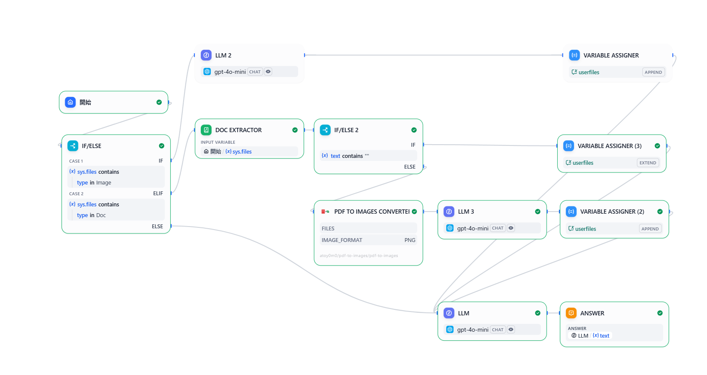

# PDF to Images Converter Plugin

## Overview

**PDF to Images** is a powerful Dify plugin that converts PDF files to high-quality images using PyMuPDF. It enables seamless integration of PDF processing capabilities into your AI applications, making it easy to extract visual information from documents for further analysis by LLM vision models. Perfect for document processing workflows that need to analyze visual content, forms, diagrams, and charts.

## Troubleshooting Tip
If you can't find the file input palamater, please update dify to latest version. please use Dify v1.6.0 or later when running this plugin.

## sample
I hope files in /docs will help you.

## Features

- **Multi-page Support**: Convert entire PDFs with multiple pages to individual images
- **Batch Processing**: Handle multiple PDF files simultaneously  
- **Flexible Resolution**: Customizable DPI settings (72 for web, 150 for standard, 300 for high quality)
- **Format Options**: Support for PNG (lossless) and JPEG (compressed) output
- **LLM Vision Ready**: Outputs are optimized for LLM vision model processing
- **Multi-language**: Full support for English, Japanese, Chinese, and Portuguese
- **Robust File Handling**: Dynamic file processing compatible with all Dify environments

## Configuration

To set up the PDF to Images plugin, follow these steps:

1. **Install PDF to Images Plugin**
   - Access the Plugin Marketplace, locate the PDF to Images plugin, and install it.
   - Or install from GitHub repository: [PDF to Images Plugin](https://github.com/aToy0m0/dify-customplugin_pdf-to-images)

2. **No Authentication Required**
   - This plugin processes files locally and does not require API keys or external service authentication.

3. **Ready to Use**
   - The plugin is immediately ready for use after installation.

## Tool Parameters

The PDF to Images tool provides three configurable parameters:

### File Input

**PDF Files**: Select one or multiple PDF files to convert to images.

### Resolution Settings

**DPI (Dots Per Inch)**: Control output image quality and file size.
- **72 DPI**: Web-optimized images (smaller file size)
- **150 DPI**: Standard quality (balanced size and quality)  
- **300 DPI**: High quality for printing (larger file size)

### Output Format

**Image Format**: Choose between PNG and JPEG output formats.
- **PNG**: Lossless compression, perfect for text and diagrams
- **JPEG**: Compressed format, suitable for photos and illustrations

### Advanced Configuration

The plugin automatically handles different file input methods:
- **Binary Data**: Direct file uploads are processed in memory
- **File URLs**: Remote files are downloaded with fallback support
- **Dify Internal Storage**: Seamless integration with Dify file system

## Usage

PDF to Images can be seamlessly integrated into both **Chatflow / Workflow Apps** and **Agent Apps**.

### Chatflow / Workflow Apps

Integrate PDF to Images into your pipeline by following these steps:

1. Add the PDF to Images node to the Chatflow or Workflow pipeline.
2. Configure the input parameters (files, DPI, format) according to your needs.
3. Define the input variables and UI elements for your use case.
4. Execute the pipeline to trigger PDF conversion and generate images.

### Agent Apps

Add the PDF to Images tool in the Agent application for dynamic PDF processing:

1. Add the PDF to Images tool to the Agent application.
2. Upload PDF files or provide file paths in the chat.
3. The tool will convert PDF pages to images, making visual content accessible to the LLM.
4. The extracted images can be processed and analyzed by LLM vision models.

## Advanced Features

### Batch Processing
The plugin can handle multiple PDF files simultaneously, processing them sequentially for stability while providing detailed progress information.

### Dynamic File Handling
Supports various file input methods:
- **Direct Upload**: Binary file data processed in memory
- **URL References**: Downloads from HTTP/HTTPS URLs with fallback support
- **Dify File Storage**: Seamless integration with Dify's internal file system

### Rich Metadata Output
Each converted image includes comprehensive metadata:
- Original filename and page number
- Image dimensions (width/height)
- Output resolution (DPI)
- File size information
- Processing statistics

## Performance Characteristics

| Aspect | Specification | Notes |
|--------|---------------|-------|
| **File Size Support** | Limited by available RAM | No artificial size limits |
| **Supported DPI Range** | 72-300 DPI | Higher DPI = larger output files |
| **Concurrent Processing** | Sequential | Ensures memory stability |

## Development and Deployment

For detailed development setup, deployment instructions, troubleshooting, and advanced configuration options, please refer to the [Plugin Deployment Guide](PLUGIN_DEPLOYMENT_GUIDE.md).

## Resources

### Documentation
- [Plugin Deployment Guide](PLUGIN_DEPLOYMENT_GUIDE.md) - Comprehensive development and deployment instructions
- [Privacy Policy](PRIVACY.md) - Data handling and privacy information
- [Dify Plugin Documentation](https://docs.dify.ai/plugins) - Official Dify plugin development guide

### External Resources
- [PyMuPDF Documentation](https://pymupdf.readthedocs.io/) - PDF processing library documentation
- [Dify Community](https://github.com/langgenius/dify) - Official Dify repository

## 📄 License

This project is licensed under the MIT License - see the LICENSE file for details.

## Support

For support, bug reports, or feature requests:

- **GitHub Issues**: [Report a bug or request a feature](https://github.com/aToy0m0/dify-customplugin_pdf-to-images/issues)
- **Documentation**: See [Plugin Deployment Guide](PLUGIN_DEPLOYMENT_GUIDE.md) for detailed troubleshooting
- **Dify Community**: [Join the Dify Community](https://github.com/langgenius/dify) for general Dify plugin support

## Version History

- **v1.0.0**: Production release with dynamic file processing, multi-format support, and comprehensive error handling

