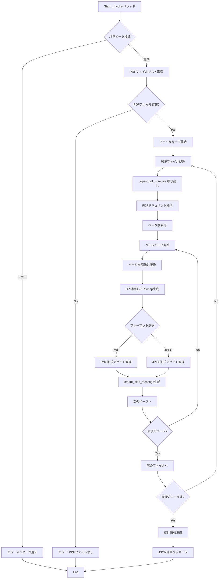
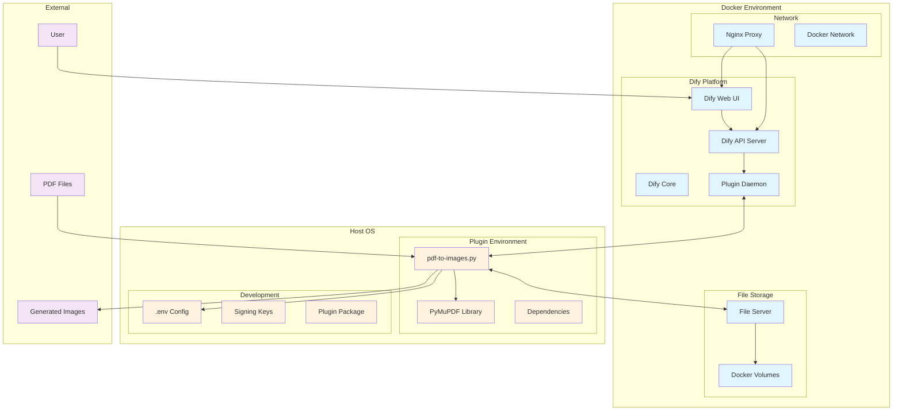
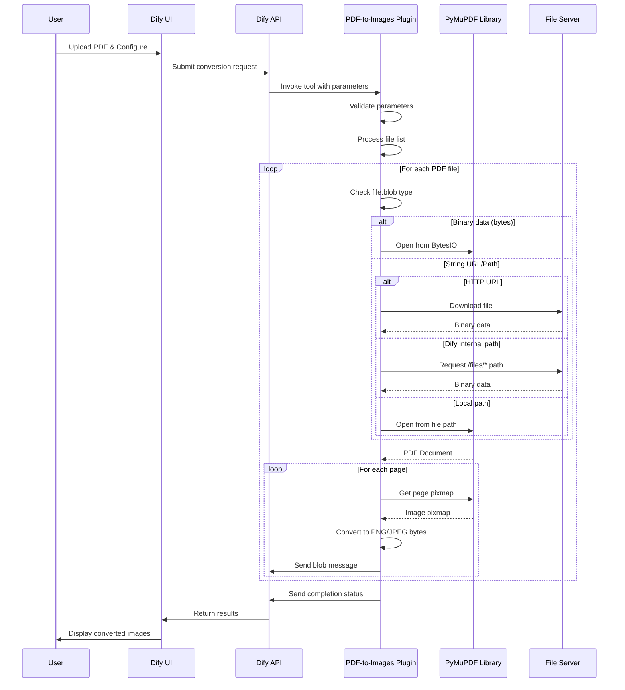

# PDF-to-Images Processing Flow Documentation

## 処理フローチャート

### メイン処理フロー


### ファイル処理フロー（_open_pdf_from_file）
```mermaid
flowchart TD
    A[Start: ファイル処理] --> B{file.blob型チェック}
    
    B -->|bytes型| C[✅ バイナリデータ処理]
    C --> D[io.BytesIO作成]
    D --> E[fitz.open実行]
    E --> Z[PDF Document返却]
    
    B -->|str型| F[⚠️ 文字列処理開始]
    F --> G{URLパターン判定}
    
    G -->|http/https| H[📥 HTTP URL処理]
    H --> I[requests.get実行]
    I --> J{ダウンロード成功?}
    J -->|Yes| K[io.BytesIO作成]
    K --> E
    J -->|No| L[❌ ダウンロードエラー]
    L --> ERROR[Exception発生]
    
    G -->|ローカルパス| M[📂 ローカルファイル処理]
    M --> N[fitz.open(path)実行]
    N --> O{ファイル読込成功?}
    O -->|Yes| Z
    O -->|No| P[❌ ファイルアクセスエラー]
    P --> ERROR
    
    G -->|/files/ パス| Q[🔄 Dify内部ファイル処理]
    Q --> R[ベースURL一覧生成]
    R --> S[URLループ開始]
    S --> T[完全URL構築]
    T --> U[HTTP GET実行]
    U --> V{レスポンス確認}
    V -->|200 & データあり| W[✅ 成功]
    W --> X[io.BytesIO作成]
    X --> E
    V -->|失敗| Y[次のURLへ]
    Y --> AA{最後のURL?}
    AA -->|No| S
    AA -->|Yes| BB[❌ 全URL失敗]
    BB --> ERROR
    
    B -->|その他型| CC[❌ サポート外型]
    CC --> ERROR
    
    ERROR --> DD[End: Error]
    Z --> EE[End: Success]
```

## システムアーキテクチャ図

### コンポーネント構成


### データフロー図


## 主要コンポーネントの責務

### 1. PdfToImagesTool クラス
- **役割**: メインのツール実装
- **責務**: 
  - パラメータ検証
  - ファイルリスト処理
  - 変換結果の統合
  - エラーハンドリング

### 2. _open_pdf_from_file メソッド
- **役割**: 動的ファイル処理
- **責務**:
  - file.blob型の判定
  - バイナリデータ処理（優先）
  - HTTP URLダウンロード
  - ローカルファイルアクセス
  - Dify内部ファイルサーバー連携

### 3. _invoke メソッド
- **役割**: メイン変換処理
- **責務**:
  - PDF→画像変換ループ
  - DPI適用とフォーマット選択
  - Blob メッセージ生成
  - 統計情報の集計

### 4. 外部依存関係
- **PyMuPDF (fitz)**: PDF処理とレンダリング
- **requests**: HTTP URL処理
- **io**: バイナリストリーム処理
- **dify_plugin**: Difyプラグインフレームワーク

## エラーハンドリング戦略

### ファイルアクセスエラー
1. **バイナリデータ処理失敗**: 即座にエラー返却
2. **HTTP URL失敗**: タイムアウト・接続エラーをキャッチ
3. **ローカルファイル失敗**: ファイル存在・権限エラーをキャッチ
4. **Dify内部ファイル失敗**: 複数URLでフォールバック試行

### 変換処理エラー
1. **PDF読み込み失敗**: ファイル破損・形式エラーを検出
2. **ページ変換失敗**: 個別ページエラーを分離
3. **メモリ不足**: 大容量ファイルの適切な処理

### 回復可能性
- **ファイル単位**: 1つのPDFが失敗しても他を継続
- **ページ単位**: 1ページが失敗しても他ページを継続  
- **URL フォールバック**: 複数のサーバーURLで自動再試行